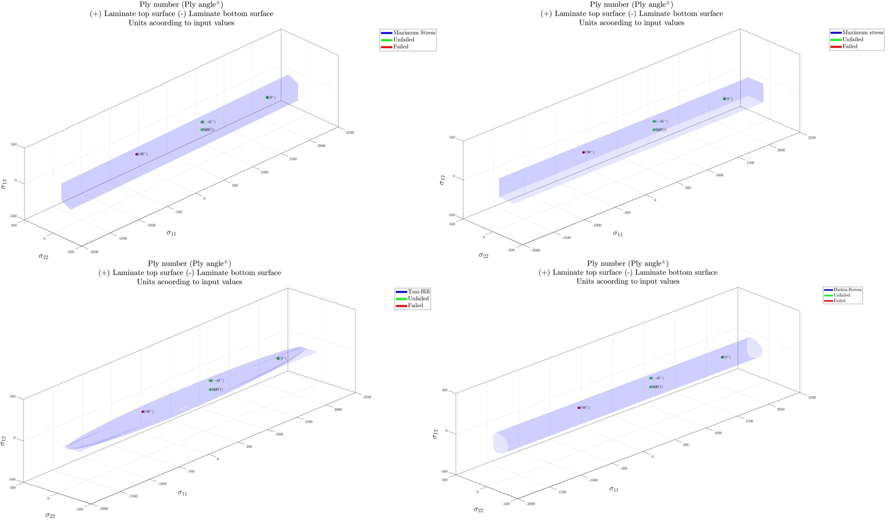

# CLTPLUS
CLTPLUS is a collection of codes for analyzing laminated composites. 
The core code is developed based on the Classical Laminate Plate Theory (CLT).
The available modules are
1. Classical Laminate Plate Theory
2. Lekhnitskii theory for orthotrpic plate with a circular hole

Four failure criteria in composites

Local and global stress-strain plots

Save report in Excel format

Stress distribution around a circular hole based on Lekhnitskii theory

Hole deformation based on Lekhnitskii theory
